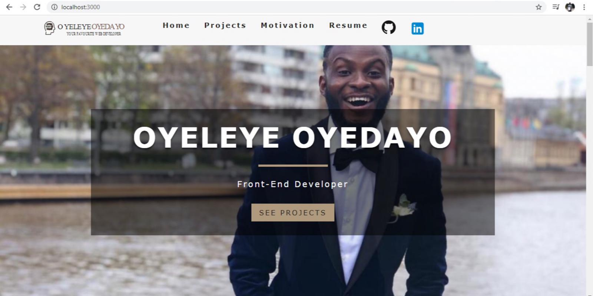

<link src='https://my-portfolio-caa21.web.app/'> Link to website! </link>

<strong> My Portfolio (STILL UPDATING!) </strong>
  

 

I installed 2 depencies: react icons and react router dom. I imported AlignRight from react icons, which I passed in a button and made it clickable (on click), when the app is used on a smaller screen or minimised, on a bigger screen. When my page is minised, the AlignRight icon appears and the nav links (pages) on my Navbar reduces to Home and Projects, while others are hidden. You can click the Align Right to toggle the 2 shown nav links.

I also imported browser router as router from react router dom, to Index js file and wrapped the route around the rendered App js (main component) within the index js file. I could have as well imported it straight to App js and return the router to wrap other components I imported into App js, but I didn't want to overcrowd the App js, as there were other components, like the pages (home, projects, resume, error etc) I have imported to App js. I however imported route and switch components from react router dom, directly to App js. I created path (exact, no strict) with Link component from react router dom, in App.js and also used it in Navbar component to link the unordered list of links to my pages on Navbar

COMPONENTS FOLDER 
In this folder, placed within src, I have Front js, Navbar js Banner js.

FRONT JS: I used this component for background image in diffrent pages. To make it very dynamic, I passed in 2 props (children and front), to Front function. I returned the Front function in a header tag, with the front prop as className inside the header tag, and then the children prop in-between the opening and closing header tags. I then set the Front function as defaultProps, where the front prop was named 'defaultFront' (I did it because I wanted the front prop to be more dynamic, as I also set it, not only to defaultFront, but also otherpagesFront, since I was going to add some other twists to the backgroundpictures or Front for different pages, using the CSS), and then imported it to different pages. I imported the Front component to home and erroe pages as <Front />, since I already set the default from Front components, and styled them in css, using defaultFront class (which I set as default inside Front component). In other pages where I wanted the backrground to be different, I add otherpagesFront class to Front component I imported to them (<Front front='otherpagesfront'/>). Remember I passed in front prop to Front function. I have a general styling for defaultFront and otherpagesFront and also a separate styling for otherpagesFront in css, to include other stylings I did not want to have in the defaultFront and also overwrite some, like the picture.

BACKGROUND IMAGE ANIMATION for Front component: In App.css, I set animation as 10s infinite for defaultFront class as slide1, and also set the same for otherpagesFront class, as slide 2, and on @keyframes, set these pictures to slide at different percentages, , where I included these pictures.

ANIMATION FOR MOTIVATION COMPONENT: Animation-area, box-area.

NAVBAR JS: I imported Navbar component to App js and returned it outside switch component, since all pages are wrapped inside switch component, with App js. This is to make sure my Navbar and changes I made within its component appears on all pages (including error page), and all other comp within switch component don't have influence on my Navbar. I used an if statement:If open, show navs and nav links, else show navs, with an if statement in Navbar component and used a toggleHandler to toggle, when it only 'show-navs', if close ( !open). In there, when you toggle, it will show Home and Projects).

BANNER JS: To make my Banner component very dynamic, I passed in 3 props: children, title and subtitle. Hence, I can decide to include or ommit any of them, while using the banner in any page. I returned the Banner component as a div and styled it with className banner. The styling has a black background, that I also made transparent, in App.css, where other styles are also added. Within that div, there is h1 where the title prop is placed. There is an empty div after that (it was eventually styled to have a line between the title and subtitle, on the banner. Afterwards, the subtitle prop is placed within 

. After that, I placed the children prop (which was later styled as a button in App.css) on its own, at the button, before closing the main div of the Banner. It should be noted that the button will appear anywhere I choose to put it. For instance, if I place it immediately after the Banner opening div, it will appear at the top, within the banner.

I imported, not only the Banner but also Link (react component) component to every page (home, error, resume, etc) component that I imported Banner component to. This is because my Banner has children prop that I passed within it and this prop has a button that can be clicked to link to a specific page. For instance, if you click on that button (showing "see projects" on it) on the banner from home page, it links (takes) you to the project page. If you click on the button (showing "return home"), from any other page, including the error page, it takes you back to the home page.

PAGES FOLDER
In this folder placed within src, I have Home js, Project js, Error js, Motivation js. Only Project component is class based. All other components within the page folder are function-based. 

All css stylings were done within App.css. index.css was not used.

<strong> Context API, Destructuring and Lifecycle Method: </strong> I used Context API, did some destructuring and lifecycle in Context, FeaturedProjects and Project Components. I created a Loading component (for a local loading in case of loading/internet problem), with a condition that it displays only if projects won't display.

''''''''''''''

Home, Projects, Motivation, CV, Error page.. (Navbar link to LinkedIn and GitHub)

I used class-based component for project page, while I used funtional-based for other pages (home, motivation, resume, error page).

Front component for the home background image.

